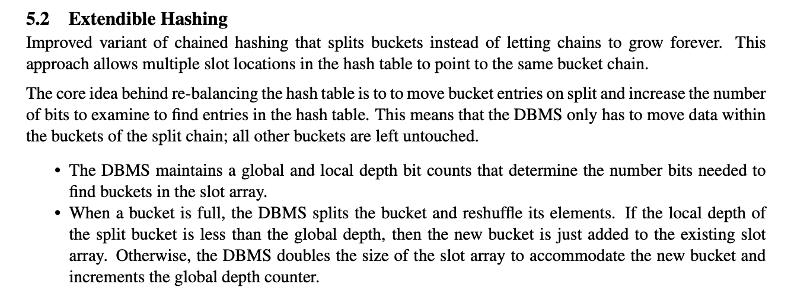

# Extendible Hashing

[Extendible Hashing (Dynamic approach to DBMS) - GeeksforGeeks](https://www.geeksforgeeks.org/extendible-hashing-dynamic-approach-to-dbms/)

Extendible hashing is a dynamic hashing technique in which the hash function is modified as the size of the hash table increases. It is commonly used in database systems to implement indexing. In extendible hashing, each bucket can store multiple records and each bucket is identified by a local directory. The global directory keeps track of the local directories and is expanded as the number of buckets increases.




- 目录：存储指向桶的指针。
- 桶：哈希键值对，如果局部深度小于全局深度时，一个桶可能包含不止一个指针指向它。
- 全局深度：和目录相关联，也就是哈希后取的比特数。
- 局部深度：和桶关联，表示桶中的数据是哈希后取低`x`位得到的。

插入数据，流程如下：

1. 将`key`哈希后，如果全局深度为`n`，那么取低`n`位比特。比如`n = 4`时，哈希出来的结果为`xxx0011`，表示这个`key`应该存储到`dir[0011]`指向的桶中。
2. 如果桶已经满了，那么比较全局深度和局部深度的大小。
3. 如果相等，`dir`目录项扩容一倍，全局深度相应增加`1`。新增的那些`dir[i]`指向`dir[i - Size]`。比如开始时全局深度为`2`，那么`dir`大小为`4`，扩容后大小为`8`，其中`dir[5]`应该指向`dir[1]`。因为`5`中对应的`key`哈希值低`3`位为`101`，在还没扩容之前，低`2`位为`01`。也就意味着，现在本该存储在`dir[5]`中的`key`之前存在`dir[1]`中，我们直接将`dir[5] = dir[1]`，共用。当全局深度比局部深度大`n`时，有`2^n`个`dir`目录项共用这个桶。
4. `dir`扩容后，再次尝试插入，这个时候桶还是满的，不过局部深度比全局深度小。
5. 如果局部深度比全局深度小，我们将局部深度增加`1`，比如原来是`2`，现在变成`3`，那么里面的`key`哈希值低两位都是相同的，第`3`位的`0`和`1`可以把这里面的`key`分成两部分。
6. 分完之后，让`dir`中低`3`位是`0xx`和`1xx`的目录项分别指向拆分后的桶。

```cpp
void ExtendibleHashTable<K, V>::Insert(const K &key, const V &value) {
  // UNREACHABLE("not implemented");
  std::scoped_lock<std::mutex> lock(latch_);
  auto directory_index = IndexOf(key);
  auto target_bucket = dir_[directory_index];

  while (!target_bucket->Insert(key, value)) {
    // 1. If the local depth of the bucket is equal to the global depth,
    //  increment the global depth and double the size of the directory.
    LOG_DEBUG("stage1: dir_.size() =  %ld", dir_.size());
    if (GetLocalDepth(directory_index) == GetGlobalDepth()) {
      global_depth_++;
      LOG_DEBUG("start loop.. dir_.size() =  %ld", dir_.size());
      int length = dir_.size();
      dir_.resize(length << 1);  // <<1 is same as *2
      for (int i = 0; i < length; i++) {
        dir_[i + length] = dir_[i];  // length =4
                                     //  dir[4]=dir[0] 100 000
                                     //  dir[5]=dir[1] 101 001
                                     //  dir[6]=dir[2] 110 010
                                     //  dir[7]=dir[3] 111 011
      }
    }
    LOG_DEBUG("stage2: Increment the local depth of the bucket.");
    // 2. If local depth lower than global depth , Increment the local depth of the bucket.
    target_bucket->IncrementDepth();

    // 3. Split the bucket and redistribute
    //  directory pointers & the kv pairs in the bucket.
    LOG_DEBUG("stage3:  Split the bucket and redistribute");
    auto mask = 1 << (target_bucket->GetDepth() - 1);
    auto new_bucket = std::make_shared<Bucket>(bucket_size_, target_bucket->GetDepth());
    auto old_bucket = std::make_shared<Bucket>(bucket_size_, target_bucket->GetDepth());
    num_buckets_++;
    // 3.1. Redistribute the directory pointers.
    for (size_t i = 0; i < dir_.size(); ++i) {
      if (dir_[i] == target_bucket) {
        if ((i & mask) == 0) {
          dir_[i] = new_bucket;
        } else {
          dir_[i] = old_bucket;
        }
      }
    }
    // 3.2. Move the kv pairs from the target bucket to the new two bucket.
    for (auto &item : target_bucket->GetItems()) {
      auto cur_directory_index = IndexOf(item.first);
      dir_[cur_directory_index]->Insert(item.first, item.second);
    }
    directory_index = IndexOf(key);
    target_bucket = dir_[directory_index];
  }
}
```